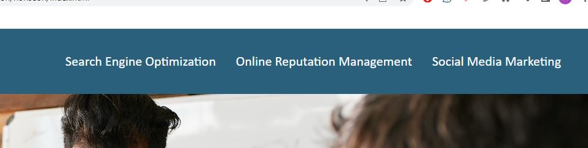

# Horiseon: HTML, CSS, and Git: Code Refactor

## Description

The purpose of this deployment is to demonstrate junior developer ability to refactor existing code to meet agile standards. For this simulated challenge, a marketing agency hired me to refactor an existing site to make it more accessible. The requirements for accessibility by the project's standards were noted in acceptance criteria, some examples include: checking that all links are functioning correctly, increasing efficiency of the CSS by consolidating selectors and properties, organizing them to follow the semantic structure of the HTML elements, and including comments before each element or section of the page. This effort will optimize the site for search engines and serves as a educational tool early on in my coding journey to becoming a creative app developer. It enforces basic knowledge of HTML/CSS, markdown, git, github and fundamental practices for deploying a website.

- semantic HTML elements
- organzing elements to follow a logical structure independent of styling and positioning
- format accessible alt attributes
- element positioning
- working with header tags
- and meta data in the head tag
- creating, cloning, and deploying repos from Github

## Table of Contents (Optional)

If your README is long, add a table of contents to make it easy for users to find what they need.

- [Installation](#installation)
- [Usage](#usage)
- [Badges](#badges)
- [How_to_Contribute](#how_to_contribute)
- [Credits](#credits)
- [License](#license)

## Installation

No installation needed.

## Usage

Use the navbar to navigate the page at https://arishorts.github.io/horiseon/

## Badges

 

## How_to_Contribute

If you would like to contribute, refer to the [Contributor Covenant](https://www.contributor-covenant.org/)

## Credits

- Mosh Hamedani: https://github.com/mosh-hamedani
- Contact Me Page: https://codewithmosh.com/

## License

MIT License https://choosealicense.com/licenses/mit/

---

© 2022 Ariel Schwartz LLC. Confidential and Proprietary. All Rights Reserved.
